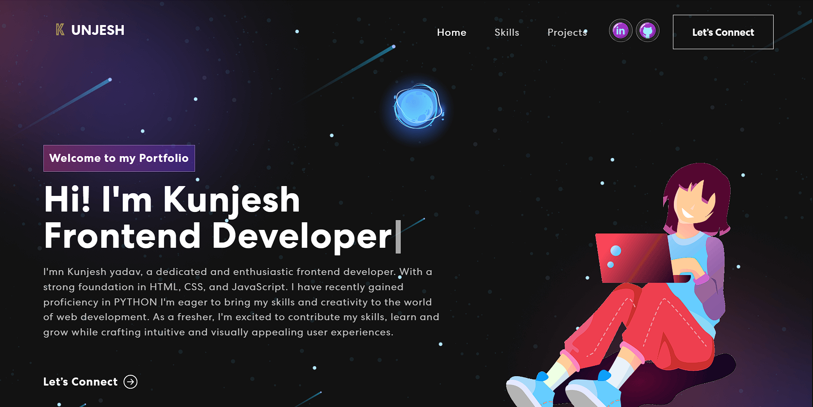

# Kunjesh  Yadav - Personal Portfolio Website in React

Built using:

- Front-end library: React
- CSS framework: React-bootstrap
- CSS animations library: Animate.css

In the /personal-portfolio, you can run:

### `npm start`

Runs the app in the development mode.\
Open [http://localhost:3000](http://localhost:3000) to view it in your browser.

The page will reload when you make changes.\
You may also see any lint errors in the console.

### `npm test`

### `npm run build`# React_Portfolio
